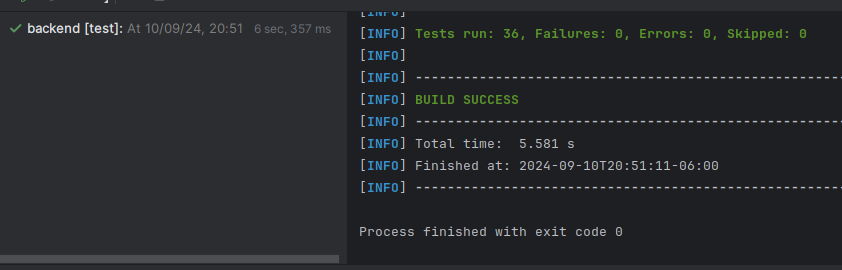
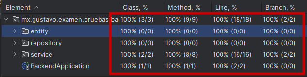

# sa-examen-pruebas-unitarias-backend-msa
# Examen de pruebas unitarias para backend

@Autor: Gustavo Román Martínez

# Cómo ejecutar las pruebas
## 1. Desde la terminal
1. Abra su terminal favorita en Linux, Mac o windows
2. Escriba el siguiente comando:
```
mvn test
   ```
Pantallazo del resultado obtenido:



3. Listo :-)

## 2. Desde su IDE
1. Abra su IDE preferido
2. Abra el proyecto en su IDE
3. Busque y abra la carpeta "test" y las clases de test dentro del proyecto
4. De clic derecho sobre la clase de test y de clic en la opción "Run Test" ó "Ejecutar test" según su IDE
5. Cobertura de pruebas:

# Cobertura de pruebas unitarias


# Características técnicas del proyecto
1. Versión de Java SDK: 22.
2. Construcción: Maven 3.9.8
3. Framework Spring boot
4. Framework Spring Data JPA
5. Librería Lombok
6. Tecnologías: Jakarta EE
7. Codificación de caracteres UTF-8

# Solución a posibles situaciones
### 1. Algunas versiones antiguas de Eclipse no detectan la librería Lombok automáticamente.

Si su IDE indica que a las clases del proyecto les faltan los métodos getters y setters es porque no tiene habilitado el
"procesador de anotaciones" en el IDE, y por eso no detecta en tiempo de desarrollo que la librería Lombok inyectará
dichos getters y setters en el futuro, durante el tiempo de compilación y de testing.
No tener habilitado el "procesador de anotaciones" no detectará las anotaciones de Lombok como @Data, @Slf4j, etc.
#### Solución:
Para eclipse, IDEA y otros en la página de lombok: 
1. https://projectlombok.org/setup/eclipse
2. https://projectlombok.org/setup/intellij

### 2. Se requiere la versión 3.9.8 o superior de maven
#### Solución:
Instale y configure la versión adecuada de maven en su computadora:
1. https://maven.apache.org/install.html
2. https://maven.apache.org/configure.html